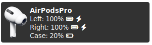
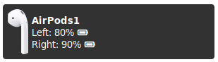

# Airpods Notification

This Rust application provides a showcase for my investigation of the BLE proximity protocol by Apple. It provides the battery status and other data transmitted by Airpods and Beat headphones. My research is documented [here](doc/proximity_protocol.md) and does not only summarize references, but also extend it by following newly discovered attributes:

* Lid Status (Open, Close event and counter)
* UTP field (left, right airpod in ear/in case)

The application provides two modes:

* Nearby - default when application runs. It shows a notification when a proximity event by some near airpods are sent.
* Monitor - Requires the argument `--monitor` and lists all events in the terminal without any range limitation.

It depends and two libraries:

* [`btleplug`](https://docs.rs/btleplug/latest/btleplug/) for cross-platform BLE 
* [`notify-rust`](https://docs.rs/crate/notify-rust/latest) for cross-platform notifications

The application is only tested on Linux and requires a libnotify daemon running on your linux.

## Roadmap

* [ ] Decoding of unknown attributes in the protocol
* [ ] Platform support for Windows and Linux (Systemd, Windows Services)
* [ ] Testing of further devices
* [ ] Better intgration in swaybar

## Tested Devices

* Airpods 1
* Airpods Pro 1
* Beats Studio 3

## References

* [hexway/**apple_bleee**](https://github.com/hexway/apple_bleee) - experimental sniffing tool
* [tzY15368/**WinPods**](https://github.com/tzY15368/WinPods)
* [adolfintel/**OpenPods**](https://github.com/adolfintel/OpenPods) - Android App

## Licenses

 The MIT License (MIT)

Copyright © 2022 Johannes Fischer

Permission is hereby granted, free of charge, to any person obtaining a copy of this software and associated documentation files (the “Software”), to deal in the Software without restriction, including without limitation the rights to use, copy, modify, merge, publish, distribute, sublicense, and/or sell copies of the Software, and to permit persons to whom the Software is furnished to do so, subject to the following conditions:

The above copyright notice and this permission notice shall be included in all copies or substantial portions of the Software.

THE SOFTWARE IS PROVIDED “AS IS”, WITHOUT WARRANTY OF ANY KIND, EXPRESS OR IMPLIED, INCLUDING BUT NOT LIMITED TO THE WARRANTIES OF MERCHANTABILITY, FITNESS FOR A PARTICULAR PURPOSE AND NONINFRINGEMENT. IN NO EVENT SHALL THE AUTHORS OR COPYRIGHT HOLDERS BE LIABLE FOR ANY CLAIM, DAMAGES OR OTHER LIABILITY, WHETHER IN AN ACTION OF CONTRACT, TORT OR OTHERWISE, ARISING FROM, OUT OF OR IN CONNECTION WITH THE SOFTWARE OR THE USE OR OTHER DEALINGS IN THE SOFTWARE.

Graphics are taken from the project [adolfintel/**OpenPods**](https://github.com/adolfintel/OpenPods).

AirPods is a trademark of Apple inc.